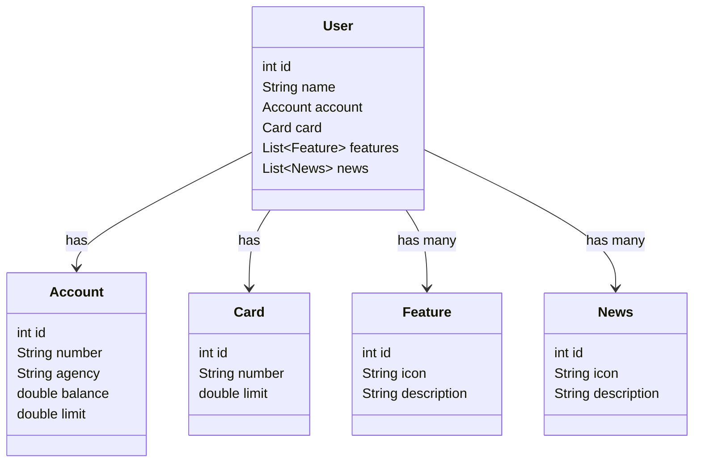

### santander backend

```mermaid
classDiagram
    class User {
        int id
        String name
        Account account
        Card card
        List~Feature~ features
        List~News~ news
    }

    class Account {
        int id
        String number
        String agency
        double balance
        double limit
    }

    class Card {
        int id
        String number
        double limit
    }

    class Feature {
        int id
        String icon
        String description
    }

    class News {
        int id
        String icon
        String description
    }

    User --> Account : has
    User --> Card : has
    User --> Feature : has many
    User --> News : has many
``` 
